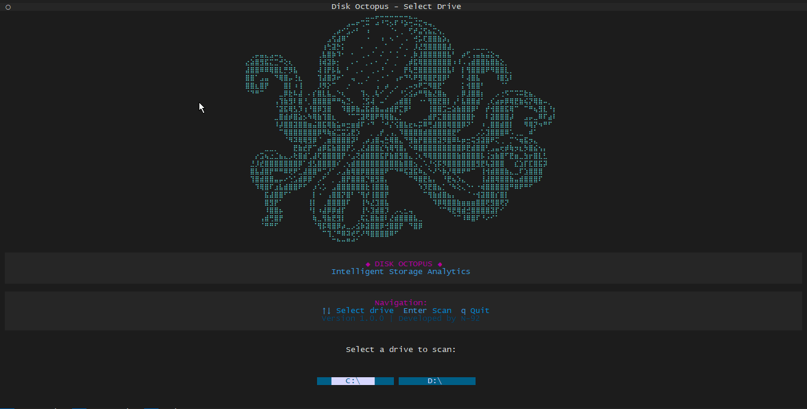
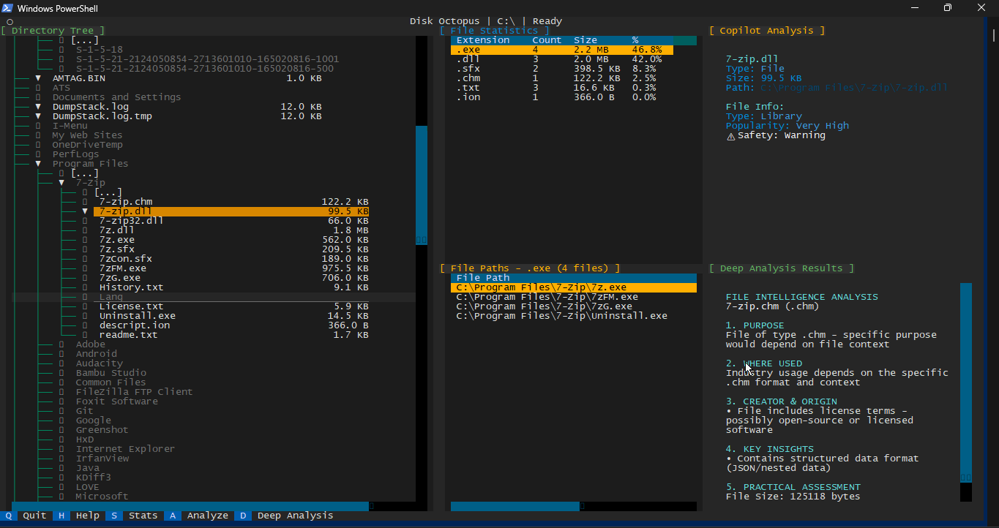
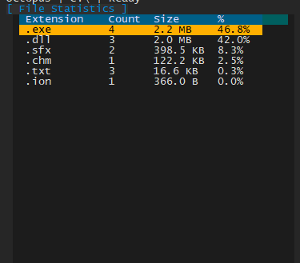
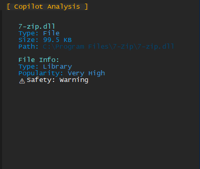
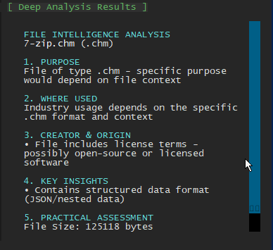
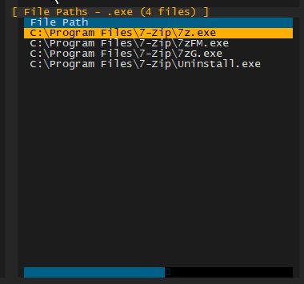

# 🐙 Disk Octopus

**Intelligent Storage Analytics powered by AI**

A sophisticated terminal-based disk analysis tool that visualizes file system structure, provides real-time statistics, and leverages AI-powered analysis for deep insights into your storage.

## Features

- **Interactive File Tree** - Smart lazy-loading of directory structures with real-time size metrics
- **Real-time Statistics** - Comprehensive file type analysis and storage distribution
- **AI-powered Analysis** - Intelligent file content evaluation with pattern recognition
- **Deep Analysis** - Detailed insights using Copilot integration (up to 5MB files supported)
- **Pattern Detection** - Security risk identification and intelligent file categorization
- **Responsive UI** - Smooth navigation with resizable panels and intuitive controls

## Screenshots

### Splash Screen
Welcome screen with beautiful octopus art, project information, and drive selection interface.


### Main Interface
The comprehensive disk analysis interface showing directory tree, file statistics, and analysis panels.


### File Statistics Panel
Real-time statistics showing file type distribution, storage consumption, and detailed breakdowns.


### Copilot Analysis Panel
Enhanced analysis powered by GitHub Copilot integration with AI commentary and pattern detection.


### Deep Analysis Results
Intelligent AI-powered analysis of selected files with detailed insights and categorization.


### File Paths Display
Comprehensive file path listing with size information and file organization details.


## Quick Start Guide

### Prerequisites Check

Before you begin, ensure your system meets these requirements:

**Required:**
- Python 3.10 or higher
- pip (Python package manager)
- Git (for cloning the repository)

**Check your versions:**
```bash
python --version
pip --version
git --version
```

If any of these are missing, visit:
- Python: https://www.python.org/downloads/
- Git: https://git-scm.com/downloads

### Step 1: Download the Repository

Open your terminal/command prompt and run:

```bash
git clone https://github.com/yourusername/disk-octopus.git
cd disk-octopus
```

Or manually download the ZIP file from GitHub and extract it.

### Step 2: Install Python Dependencies

**Windows (Command Prompt or PowerShell):**
```powershell
pip install -r requirements.txt
```

**macOS/Linux (Terminal):**
```bash
pip install -r requirements.txt
```

⏳ *This will install: `textual`, `rich`, and other required packages*

### Step 3: Verify Installation

Test that everything is installed correctly:
```bash
python -c "import textual; import rich; print('✓ All dependencies installed!')"
```

You should see: `✓ All dependencies installed!`

### Step 4: Run the Application

**Windows:**
```powershell
python main.py
```

**macOS/Linux:**
```bash
python main.py
```

The application will launch with a drive selection screen. Select a drive to analyze!

## Installation

### System-Specific Setup

#### Windows Setup

1. **Open PowerShell as Administrator** (recommended for best compatibility)
2. Navigate to the project folder:
   ```powershell
   cd C:\path\to\disk-octopus
   ```
3. Create a virtual environment (optional but recommended):
   ```powershell
   python -m venv venv
   venv\Scripts\Activate.ps1
   ```
4. Install dependencies:
   ```powershell
   pip install -r requirements.txt
   ```
5. Run the application:
   ```powershell
   python main.py
   ```

#### macOS Setup

1. **Open Terminal**
2. Navigate to the project folder:
   ```bash
   cd /path/to/disk-octopus
   ```
3. Create a virtual environment (optional but recommended):
   ```bash
   python3 -m venv venv
   source venv/bin/activate
   ```
4. Install dependencies:
   ```bash
   pip install -r requirements.txt
   ```
5. Run the application:
   ```bash
   python main.py
   ```

#### Linux Setup

1. **Open Terminal**
2. Navigate to the project folder:
   ```bash
   cd /path/to/disk-octopus
   ```
3. Create a virtual environment (recommended):
   ```bash
   python3 -m venv venv
   source venv/bin/activate
   ```
4. Install dependencies:
   ```bash
   pip install -r requirements.txt
   ```
5. Run the application:
   ```bash
   python main.py
   ```

### Optional: GitHub Copilot Integration

For enhanced AI-powered analysis, install GitHub Copilot CLI:

**Prerequisites:**
- GitHub CLI (`gh`) installed
- GitHub account with Copilot access

**Installation:**
```bash
gh extension install github/gh-copilot
```

Verify installation:
```bash
gh copilot --version
```

**Note:** The application works perfectly without Copilot. If Copilot is not available, Disk Octopus automatically uses intelligent pattern-based analysis.

## Dependencies

The `requirements.txt` file includes:

| Package | Purpose |
|---------|---------|
| `textual` | Terminal UI framework |
| `rich` | Beautiful terminal formatting |
| `typing-extensions` | Type hints support |

All are automatically installed with `pip install -r requirements.txt`

## Usage

### Launch the Application

```bash
python main.py
```

### Initial Screen

You'll see the splash screen with:
- Beautiful braille octopus art 🐙
- Project title and tagline
- Navigation instructions
- Available drives to scan

### Keyboard Shortcuts

| Key | Action |
|-----|--------|
| **q** | Quit application |
| **h** | Show help menu |
| **s** | Display statistics |
| **a** | Analyze selected item (file type) |
| **d** | Deep analysis of file contents |
| **↑/↓** | Navigate drive selection / tree items |
| **Enter** | Select and scan drive |

### Mouse Controls

- **Single-click** - Select items
- **Double-click** - Expand/collapse folders
- **Drag borders** - Resize panels

## Interface

### Main Screen Layout

```
┌────────────────────────────────────────────────────────────┐
│ Directory Tree        │ File Statistics  │ Copilot Analysis │
│ (Left Panel)          │ (Top Right)      │ (Scrollable)     │
├───────────────────────┼──────────────────┼──────────────────┤
│                       │ File Paths       │ Deep Analysis    │
│ (Expandable)          │ (Bottom Right)   │ Results          │
└────────────────────────────────────────────────────────────┘
```

## Features Detail

### File Type Analysis
Recognizes 40+ file types across multiple categories:
- **Code**: Python, JavaScript, Java, C++, Go, Rust, TypeScript, etc.
- **Documents**: PDF, DOCX, XLSX, PPTX, TXT, MD, etc.
- **Media**: MP4, MP3, JPG, PNG, GIF, SVG, etc.
- **Config**: YAML, TOML, JSON, INI, XML, etc.
- **Specialized**: PGN (chess), SQL, archives, binaries, and more

### Deep Analysis
When using the 'd' key:
1. Analyzes file content with pattern recognition
2. Classifies file purpose and usage context
3. Identifies creator/origin information
4. Extracts key insights and metadata
5. Provides practical assessment

Supports files up to 5MB in size.

### Statistics Panel
Real-time display of:
- File type distribution
- Storage consumption by category
- File count statistics
- Percentage breakdowns

## Configuration

Edit `config.py` to customize:
- Display settings
- Analysis parameters
- Color schemes
- File type mappings

## Development

### Project Structure

```
disk-octopus/
├── main.py                 # Application entry point
├── textual_ui.py           # Main UI implementation
├── copilot_analyzer.py     # AI analysis engine
├── disk_scanner.py         # File system scanning
├── file_type_analyzer.py   # File type classification
├── config.py               # Configuration settings
├── requirements.txt        # Python dependencies
└── textual_ui.css          # UI styling
```

### Running Tests

```bash
# Current version includes integrated validation
# Run deep analysis tests on sample files
python main.py
```

## Performance

- **Lazy-loading**: Directory trees only expand when requested
- **Intelligent Caching**: File analysis results are cached for repeated queries
- **Optimized Rendering**: Efficient terminal UI updates minimize CPU usage
- **Streaming Analysis**: Large file analysis uses streaming to avoid memory issues

## Supported Platforms

- **Linux** - Full support
- **macOS** - Full support
- **Windows** - Full support (PowerShell recommended)

## AI Integration

### GitHub Copilot

Disk Octopus integrates with GitHub Copilot CLI for enhanced analysis:

- Provides intelligent commentary on file contents
- Identifies patterns and security concerns
- Generates actionable insights
- Fallback to pattern-based analysis if Copilot unavailable

**Note**: Copilot CLI optional; application works without it.

## Known Limitations

- Binary files show pattern-based analysis (no content read)
- Very large directories (10,000+ files) may take time to scan initially
- Terminal resize during scanning may cause display artifacts (restart scan)
- Copilot analysis limited to 5MB per file

## Troubleshooting

### Common Issues & Solutions

#### "Python command not found" / "python: command not recognized"

**Windows:**
- Python not installed or not added to PATH
- Solution: Reinstall Python from https://www.python.org/downloads/
- Make sure to check "Add Python to PATH" during installation
- After installation, restart your terminal

**macOS/Linux:**
- Try using `python3` instead of `python`
  ```bash
  python3 main.py
  ```

#### "pip install fails" / "ModuleNotFoundError"

- Ensure pip is up to date:
  ```bash
  python -m pip install --upgrade pip
  ```
- Try installing dependencies again:
  ```bash
  pip install -r requirements.txt
  ```
- If that fails, try with `--user` flag:
  ```bash
  pip install --user -r requirements.txt
  ```

#### "Permission denied" errors

**Windows:** Run PowerShell as Administrator
**macOS/Linux:** Use `sudo` (not recommended, try virtual environment first)
```bash
python3 -m venv venv
source venv/bin/activate
pip install -r requirements.txt
python main.py
```

#### Application Won't Start / Crashes Immediately
- Verify Python 3.10+ installed: `python --version`
- Verify all dependencies: `python -c "import textual; import rich; print('OK')"`
- Reinstall all dependencies:
  ```bash
  pip install -r requirements.txt --force-reinstall
  ```

#### UI Display Issues
- Try running in a terminal with minimum 80x24 character space
- On Windows, use **Windows Terminal** (better than Command Prompt)
- On macOS, use **Terminal** or **iTerm2**
- On Linux, use **GNOME Terminal**, **Konsole**, or **xterm**

#### Deep Analysis Not Working
- Verify GitHub Copilot CLI installed: `gh copilot --version`
- Check file permissions and read access to the file
- Ensure file is under 5MB in size
- Copilot analysis works without installation (fallback to pattern-based)

#### Drive Selection Shows No Drives
- On Windows, ensure you're running in PowerShell (not Command Prompt)
- Check that drives are accessible and mounted
- Try selecting a drive letter manually (C:, D:, etc.)

### Getting Help

If you encounter issues:

1. **Check the Help Menu** - Press 'h' in the application
2. **Check Requirements.txt** - Verify your Python version
3. **See Troubleshooting Above** - Most issues are covered
4. **Open an Issue on GitHub** - Include:
   - Your OS and Python version
   - Error message (if any)
   - Steps to reproduce

## Version

**v1.0.0** - Initial Release

## Author

Developed by **N-92**

## License

MIT License - See LICENSE file for details

## Contributing

Contributions welcome! Please:
1. Fork the repository
2. Create a feature branch
3. Submit a pull request with clear description

## Roadmap

- [ ] Export analysis reports (JSON, CSV)
- [ ] Comparison between drives
- [ ] Custom file type definitions
- [ ] Analysis history tracking
- [ ] Scheduled background scanning
- [ ] Multi-drive simultaneous analysis

## Support

For issues, feature requests, or questions:
- Open an issue on GitHub
- Check existing issues for solutions
- Review the help menu (press 'h' in app)

---

**🐙 Happy analyzing!**
